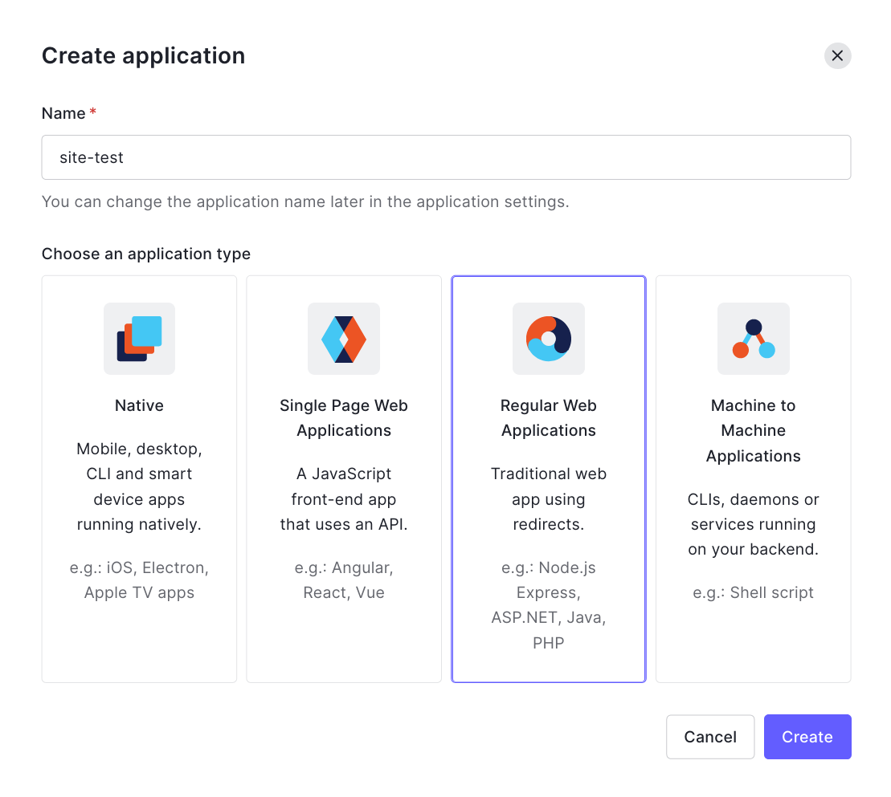
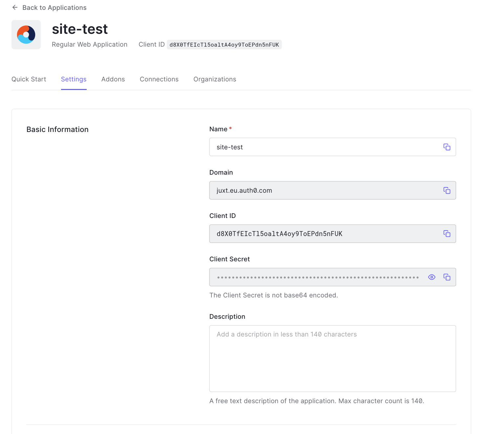

= Authentication
:toc: left

== Introduction

NOTE: TODO

== Add a trusted identity provider

Site does not store user credentials but requires that you provide one or more trusted identity providers that are compatible with OpenID Connect Discovery. Examples include https://www.keycloak.org/[Keycloak], https://auth0.com/[Auth0], Okta, Google, https://aws.amazon.com/cognito/[AWS Cognito] and many more.

.Adding Auth0 as an OpenID Connect provider
====
Create an account with Auth0 and note the Auth0 tenant (domain).

[source,clojure]
----
(add-openid-provider! "https://juxt.eu.auth0.com/.well-known/openid-configuration")
----

From Auth0, create an application with a name of your choice and an application
type of `Regular Web Applications`.

For our example, we'll use the name `Site Test`.

Under settings, take the value of `Client ID` and copy the `Client Secret`, pasting them into the code below, replacing `<client-id>` and `<client-secret>` respectively.

[source,clojure]
----
(add-openid-login!
:name "auth0"
:provider "https://juxt.eu.auth0.com/.well-known/openid-configuration"
:client-id "<client-id>"
:client-secret "<client-secret>")
----
====

Back in the Auth0 application settings, fill out the `Application Login URI` and `Allowed Callback URLs`.

Application Login URI:: bar

Allowed Callback URLs:: foo

image::Auth0-Application-URIs.png[]

We're now ready to test.

----
curl -Li https://site.test/_site/openid/auth0/login
----

== Understanding the authentication flow

Site must acquire an ID_TOKEN in order to identify a subject.

The way it does this is by communicate with an identity provider.

In the language of OAuth2, Site takes on the role of a Client and the Identity
Provider takes on the role of the Authorization Server.

Once Site has established confidence in the subject's claims, it can then
proceed to authorize access to its resources.

.How Site gets an ID_TOKEN
[plantuml,authentication-flow,png]
....
skinparam monochrome true
autonumber

actor Alice as user
participant browser

box Site
participant Client as site
database XT
end box

box Identity Provider
participant "/authorize" as auth
participant "/login" as login
participant "/token" as token
end box

browser -> site: GET /login
site <- XT: Look up config of\nIdentity Provider
site -> XT: Create session cookie,\nwith state value
site -> browser: Set session cookie,\nredirect to /authorize
browser -> auth: GET /authorize, no session cookie
note over site: We are asking Alice to authorize Site's access to her details
note over auth: Who is this?
auth -> browser: Redirect to /login
browser -> login: GET /login
login -> browser: login page HTML
user -> browser: Enter password
browser -> login: POST
note over login: OK, it's Alice
login -> browser: Set session cookie, redirect to /authorize
browser -> auth: GET /authorize, this time with cookie
auth -> browser: Do you want to authorize Site?
user -> browser: Yes please!
browser -> auth: Yes
auth -> browser: Redirect to Site with this code
browser -> site: Here is the code and state
site <- XT: Check state value
site -> token: POST code
token -> site: ID_TOKEN containing\nAlice's details
site -> XT: Add ID_TOKEN to session
site -> browser: Upgrade session cookie

....
