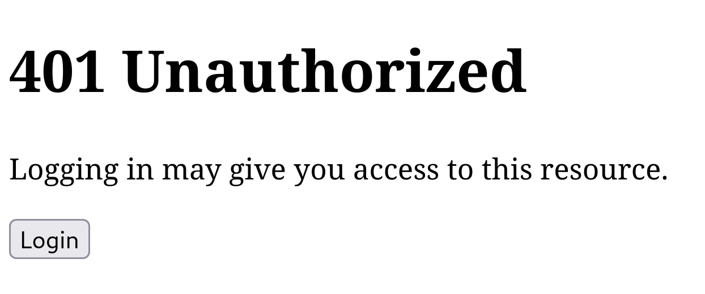

= Authentication
:toc: left
:experimental:

== Introduction

To authorize a private resource we will need to establish the identity of the
person (or machine) that it attempting to access it.

Currently, Site does not provide its own authentication service but relies on a
third-party service known as an *OpenID Provider* that is capable of
authenticating an end-user and providing claims about them.

If Site trusts the OpenID Provider, and the OpenID Provider trusts the claims
made by the user, then Site can trust those user claims too.

When communicating with an OpenID Provider, Site assumes the role of an
https://www.rfc-editor.org/rfc/rfc6749#section-1.1[_OAuth 2.0 Client_] or, in the terminology of OpenID, a *Relying Party*.

When an unidentified user accesses Site, Site can request an *ID Token*, which
contains the user's claims, from the OpenID Provider. These claims are trusted
by the OpenID Provider, which signs them with a cryptographic signature that
Site can verify.

TIP: Terminology for OpenID Connect can be found at
https://openid.net/specs/openid-connect-core-1_0.html#Terminology

Typically, the process of integrating an OpenID Provider comprises two steps.

The first step is to register an account with the OpenID Provider and let Site
fetch the OpenID Provider's configuration. This is described in
<<registering-the-openid-provider>>.

The second step is to create an OAuth 2.0 Client application which is what Site
will use to acquire an ID Token containing information (claims) about the
end-user we want to authenticate. This step is described in
<<creating-the-client-application>>.

It's possible to register mutliple OpenID Providers with Site, and there are
situations where there might be a need for more than one OAuth 2.0 Client
application to exist for a given OpenID Provider.

== Selecting an OpenID Provider

How the OpenID Provider establishes trust in the user's claims is up to the
OpenID Provider. It's important which choose a reputable provider that you
trust.

When it comes to choosing an OpenID Provider there are many options
available. Site is compatible with any of the many OpenID Providers that
implements the https://openid.net/specs/openid-connect-discovery-1_0.html[OpenID
Connect Discovery] protocol.

Examples include:

* https://auth0.com/[Auth0]
* https://aws.amazon.com/cognito/[AWS Cognito]
* https://developers.facebook.com/docs/facebook-login/limited-login/token/[Facebook]
* https://developers.google.com/identity/protocols/oauth2/openid-connect[Google]
* https://www.keycloak.org/[Keycloak]
* https://www.ory.sh/kratos[Ory Kratos]

[[registering-the-openid-provider]]
== Registering the OpenID Provider

The examples in this section explain how to configure a particular OpenID
Provider (Auth0) but the process is similar for other providers.

Site needs to be configured which each OpenID Provider via the
`install-openid-provider!` function, as demonstrated in
<<installing-an-openid-provider>>.

Site will then download and store the OpenID Provider's configuration which will
allow it to interact with the OpenID Provider, exchange information and verify the
signatures when the OpenID Provider returns cryptographically signed data.

[[installing-an-openid-provider]]
.Adding Auth0 as an OpenID Provider
====
We first created an account with Auth0 and chose the name `juxt` in the EU
region. Auth0 created the `juxt.eu.auth0.com` domain for us, representing the
Issuer.

|===
|Issuer Identifier|+https://juxt.eu.auth0.com/+
|===

Then we registered Auth0 as an OpenID Provider in Site, with the *Issuer
Identifier* as a parameter:

[source,clojure]
----
(install-openid-provider! "https://juxt.eu.auth0.com/")
----

CAUTION: If you've decided to use Auth0 too, you'll have to decide on a tenant
name and your Issuer Identifier will be different from ours. Make sure to
remember this when following the examples in this section.

====

[[creating-the-client-application]]
== Creating the OAuth 2.0 Client Application

OpenID is built open OAuth 2.0, so we must create an OAuth 2.0 Client
application which can represent Site in the OAuth 2.0 protocol.

The instructions for registering an OAuth 2.0 Client application with an OpenID
Provider are usually quite similar but you should follow the instructions
provided by your chosen OpenID Provider.

To communicate with the OpenID Provider, Site must provide a number of web
resources (endpoints). Once the OAuth 2.0 Client id and secret are known, these
can be created with the `install-openid-resources!` function.

The `install-openid-resources!` function requires the following arguments:

[cols="2,8"]
|===
|name|A unique name identifying the *OpenID Provider* and application registered in Site. This is encoded into the application's URIs so it's possible to have many such combinations.
|issuer-id|The *Issuer Identifier*, this is a URL, always starting with `https://`.
|client-id|The OAuth 2.0 *Client ID*
|client-secret|The OAuth 2.0 *Client Secret*
|===

If called successfully, the function will return the URIs of the various Site
resources created. These can be provided as OAuth 2.0 Client settings in the
OpenID Provider, and some of these will be required.

As a complete example, <<creating-a-client-application>> explains how we created
our client application in Auth0.

.Creating the OAuth 2.0 Client application in Auth0
[[creating-a-client-application]]
====
In Auth0 we located and selected the menu:Applications[Applications] menu item.

image::Auth0-Applications-Menuitem.png[width=20%]

This brought us to a screen listing applications, and we clicked on the button
`Create Application`.

This popped up a dialog, we chose a name of `site-test` and an application type
of `Regular Web Applications`.

image::Auth0-Create-Application.png[width=75%]

After the application was created, we accessed menu:Settings[] from the application's menu bar.

image::Auth0-Application-Settings.png[]

We copied the `Client ID` and the `Client Secret`:

|===
|Client ID|d8X0TfEIcTl5oaltA4oy9ToEPdn5nFUK
|Client Secret|zb86gDUf_rEnwENYJBeih-cAzICjjPvvumThTw6qIqCVvtP83vYFtjuHni_m2ndt
|===

We returned to the REPL to install the web resources required to be provided by
the *Relying Party* (Site) by the *OpenID Provider* (Auth0), giving the
following values:

|===
|:name|auth0-site-test
|:issuer-id|+https://juxt.eu.auth0.com/+
|:client-id|d8X0TfEIcTl5oaltA4oy9ToEPdn5nFUK
|:client-secret|zb86gDUf_rEnwENYJBeih-cAzICjjPvvumThTw6qIqCVvtP83vYFtjuHni_m2ndt
|===

We created the required web resources for the application by calling the
`install-openid-resources!` function.

[source,clojure]
----
(install-openid-resources!
:name "auth0-site-test"
:issuer-id "https://juxt.eu.auth0.com/"
:client-id "d8X0TfEIcTl5oaltA4oy9ToEPdn5nFUK"
:client-secret "zb86gDUf_rEnwENYJBeih-cAzICjjPvvumThTw6qIqCVvtP83vYFtjuHni_m2ndt")
----

Calling the `install-openid-resources!` function returned a map:

[source,clojure]
----
{:login-uri "https://site.test/_site/openid/auth0-site-test/login",
 :callback-uri "https://site.test/_site/openid/auth0-site-test/callback"}
----

This map contained the application's URIs, which we made a note of.

|===
|Application Login URI|+https://site.test/_site/openid/auth0-site-test/login+
|Allowed Callback URLs|+https://site.test/_site/openid/auth0-site-test/callback+
|===

Then we returned to the Auth0 settings and scrolled down to the `Application URIs` section.

We entered in the application URIs as shown below:

image::Auth0-Application-URIs.png[]

====

== Improving the 401 error

If the user is using a browser, it's a better user experience if we provide them
with a button to click to take them through the authentication process, and
return them to the original resource once they've been authenticated.

<<installing-improved-401>> demonstrates how we can do this.

.Installing a better 401 error page
[[installing-improved-401]]
====
Remember the `401 Unauthorized` response we got back in
<<publishing-private-resources>>? Now we can at least authenticate the end-user.

[source,clojure]
----
include::../../dev/demo.clj[tag=put-unauthorized-error-representation-for-html-with-login-link!,indent=0]
----
====

== Authenticating an end-user

Authentication is achieved by acquiring an ID_TOKEN from the OpenID
Provider. The ID_TOKEN is like a contact card for the user, and contains
personal information we can consider when deciding whether to authorize an
end-user's access to a resource.

If the end-user is using a browser, we can ask them to navigate to the
`Application Login URI` that we have installed.

Site must acquire an ID_TOKEN in order to identify a
subject. <<authentication-flow>> discusses the steps involved.

<<testing-authentication>> demonstrates how to test the authentication.

.Testing the authentication
[[testing-authentication]]
====
If we now nagivate to +https://site.test/private.html+ we get the following:

.Unauthorized

Clicking on btn:[Login] directs us to the `Application Login URI` that we have
installed for our `OpenID Provider`.

If all goes as expected, the error should change to a 403. This means we've
successfully _authenticated_, but still don't have the _permission_ to view the
private resource. That's a topic for <<authorization>>.
====

The handler at the `Application Login URI` creates a session with some initial state
before redirecting us over to the `OpenID Provider` to authenticate us.

Once authenticated, the `OpenID Provider` redirects us back to the `Callback
URI` with a code. The handler at this URI uses this code to acquire the ID_TOKEN
from the OpenID Provider, adding this to the session before redirecting us back
to our original resource.

The session now contains the information contained in the ID_TOKEN, and we can
move on to <<authorization>>.

== Understanding the authentication flow

Understanding how the ID_TOKEN is acquired is helpful in diagnosing any
authentication issues, perhaps due to misconfiguration.

<<authentication-flow>> illustrates the process.

.How Site acquires an ID_TOKEN
[[authentication-flow]]
[plantuml,authentication-flow,png]
....
skinparam monochrome true
autonumber

actor Alice as user
participant browser

box Site
participant Client as site
database XT
end box

box "OpenID Provider"
participant "/authorize" as auth
participant "/login" as login
participant "/token" as token
End box

browser -> site: GET /private.html
site <- XT: Look up config of\nOpenID Provider
site -> XT: Create session cookie,\nwith state value
site -> browser: Set session cookie,\nredirect to /authorize
browser -> auth: GET /authorize, no session cookie
note over site: We are asking Alice to authorize Site's access to her details
note over auth: Who is this?
auth -> browser: Redirect to /login
browser -> login: GET /login
login -> browser: login page HTML
user -> browser: Enter password
browser -> login: POST
note over login: OK, it's Alice
login -> browser: Set session cookie, redirect to /authorize
browser -> auth: GET /authorize, this time with cookie
auth -> browser: Do you want to authorize Site?
user -> browser: Yes please!
browser -> auth: Yes
auth -> browser: Redirect to Site with this code
browser -> site: Here is the code and state
site <- XT: Check state value
site -> token: POST code
token -> site: ID_TOKEN containing\nAlice's details
site -> XT: Add ID_TOKEN to session
site -> browser: Upgrade session cookie

....
