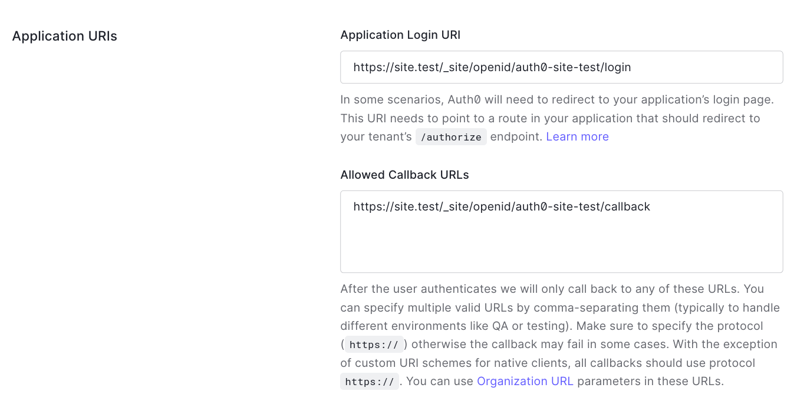

= Authentication
:toc: left

== Introduction

To authorize a private resource we will need to establish the identity of the
person (or machine) that it attempting to access it.

Currently, Site does not provide its own authentication service but relies on a
third-party service known as an _identity provider_.

If Site trusts the identity provider, and the identity provider trusts the
claims made by the user, then Site can trust those user claims too.

When it comes to choosing an identity provider, there are many options
available. Site is compatible with any of the many providers that implements the
https://openid.net/specs/openid-connect-discovery-1_0.html[OpenID Connect
Discovery] protocol.

Examples include:

* https://auth0.com/[Auth0]
* https://aws.amazon.com/cognito/[AWS Cognito]
* https://developers.facebook.com/docs/facebook-login/limited-login/token/[Facebook]
* https://developers.google.com/identity/protocols/oauth2/openid-connect[Google]
* https://www.keycloak.org/[Keycloak]
* https://www.ory.sh/kratos[Ory Kratos]

NOTE: TODO: Install a 401 error page with a redirect to login

NOTE: TODO: Get a 403

NOTE: TODO: Recognise the iss/sub pair by adding an identity

NOTE: TODO: Grant a permission to the identity to use the get-private-resource action

== Adding a trusted an identity provider

When communicating with an identity provider, Site assumes the role of an
https://www.rfc-editor.org/rfc/rfc6749#section-1.1[_OAuth2 client_].

When an unidentified user accesses Site, Site can request an _id token_ from the
identity provider that contains the user's claims. These claims are trusted by
the identity provider, who signs them with a cryptographic signature Site can
verify.

How the identity provider establishes trust in the user's claims is up to the
identity provider, so it's important which choose a reputable one which you
trust.

.Registering an account with Auth0
====

For the examples in this section, I've chosen to use Auth0.

I registered my details with Auth0 and chose the account name `juxt`. Auth0
created the `juxt.eu.auth0.com` domain for me.

====

Site can be configured to communicate with any number of identity providers.

For each provider, Site needs to be given the location of the OpenID Connect
Discovery document on the web with the `add-openid-provider!` function. Site
will then download and store the provider's configuration which will allow it to
interact with the provider, exchange information and verify the signatures when
the provider returns cryptographically signed data.

To ensure that communication between Site and the identity provider is secure we
must initially register Site as a client with the identity provider and obtain a
secret which is known only to Site and the identity provider.

The instructions for registering a client with an identity provider that
supports OpenID Connect are usually quite similar but you should follow the
instructions provided by your chosen identity provider.

As an example, <<registering-with-auth0>> explains how we registered our
instance of Site with Auth0, an identity provider that supports OpenID Connect
Discovery.

.Adding Auth0 as an OpenID Connect provider
[[registering-with-auth0]]
====

We first created an account with Auth0 and chose the name `juxt` in the EU
region. Auth0 created the `juxt.eu.auth0.com` domain for us.

With Auth0, `https://juxt.eu.auth0.com` becomes the issuer. We made a note of
this.

|===
|Issuer|+https://juxt.eu.auth0.com+
|===

Then we registered Auth0 as an identity provider in Site, with the issuer as
a parameter:

[source,clojure]
----
(put-openid-provider! "https://juxt.eu.auth0.com")
----
====

.Registering Site as an Auth0 application client
====
We then accessed the `Applications` menu item.

This brought us to a screen listing applications, and we clicked on the button
`Create Application`.

image::Auth0-Create-Application-Button.png[width=20%]

This popped up a dialog, we chose a name of `site-test` and an application type
of `Regular Web Applications`.

image::Auth0-Create-Application.png[width=75%]

After the application was created, we accessed `Settings` from the application's menu bar.

image::Auth0-Application-Settings.png[]

We noted the `Client ID` and the `Client Secret`:

|===
|Client ID|d8X0TfEIcTl5oaltA4oy9ToEPdn5nFUK
|Client Secret|zb86gDUf_rEnwENYJBeih-cAzICjjPvvumThTw6qIqCVvtP83vYFtjuHni_m2ndt
|===

Then we scrolled down to the `Application URIs` section.

We filled out the `Application Login URI` and `Allowed Callback URLs` (these
will be created in Site later on):

|===
|Application Login URI|+https://site.test/_site/openid/auth0-site-test/login+
|Allowed Callback URLs|+https://site.test/_site/openid/auth0-site-test/callback+
|===

Finally we called Site's `put-openid-login!` REPL function to let Site know the client-id and client-secret that it will need when communicating with Auth0

[source,clojure]
----
(put-openid-login!
:name "auth0-site-test"
:issuer "https://juxt.eu.auth0.com"
:client-id "d8X0TfEIcTl5oaltA4oy9ToEPdn5nFUK"
:client-secret "zb86gDUf_rEnwENYJBeih-cAzICjjPvvumThTw6qIqCVvtP83vYFtjuHni_m2ndt")
----
====

We're now ready to test.

----
curl -Li https://site.test/_site/openid/auth0/login
----

== Understanding the authentication flow

Site must acquire an ID_TOKEN in order to identify a subject.

The way it does this is by communicate with an identity provider.

In the language of OAuth2, Site takes on the role of a Client and the Identity
Provider takes on the role of the Authorization Server.

Once Site has established confidence in the subject's claims, it can then
proceed to authorize access to its resources.

.How Site gets an ID_TOKEN
[plantuml,authentication-flow,png]
....
skinparam monochrome true
autonumber

actor Alice as user
participant browser

box Site
participant Client as site
database XT
end box

box Identity Provider
participant "/authorize" as auth
participant "/login" as login
participant "/token" as token
end box

browser -> site: GET /login
site <- XT: Look up config of\nIdentity Provider
site -> XT: Create session cookie,\nwith state value
site -> browser: Set session cookie,\nredirect to /authorize
browser -> auth: GET /authorize, no session cookie
note over site: We are asking Alice to authorize Site's access to her details
note over auth: Who is this?
auth -> browser: Redirect to /login
browser -> login: GET /login
login -> browser: login page HTML
user -> browser: Enter password
browser -> login: POST
note over login: OK, it's Alice
login -> browser: Set session cookie, redirect to /authorize
browser -> auth: GET /authorize, this time with cookie
auth -> browser: Do you want to authorize Site?
user -> browser: Yes please!
browser -> auth: Yes
auth -> browser: Redirect to Site with this code
browser -> site: Here is the code and state
site <- XT: Check state value
site -> token: POST code
token -> site: ID_TOKEN containing\nAlice's details
site -> XT: Add ID_TOKEN to session
site -> browser: Upgrade session cookie

....
