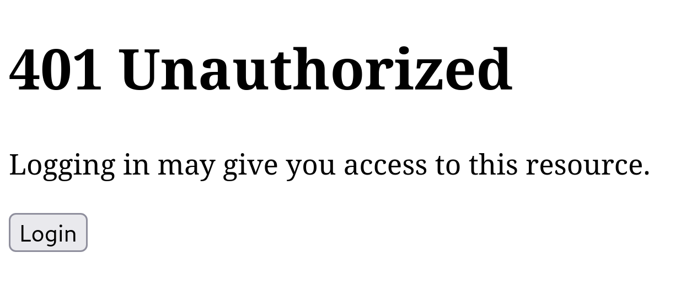

= Protecting Resources
:toc: left

[[publishing-private-resources]]
== Creating a private resource

Now let's publish an immutable private resource which can only be seen by an
authenticated user.

We'll need an action to publish a private resource.

.Creating and accessing a private resource
====

Again, let's complete the following steps:

[source,clojure]
----
include::../../dev/demo.clj[tag=create-action-put-immutable-private-resource!,indent=0]
----

[IMPORTANT]
--
Do it
--

We'll grant this permission to our REPL user.

[source,clojure]
----
include::../../dev/demo.clj[tag=grant-permission-to-put-immutable-private-resource!,indent=0]
----

[IMPORTANT]
--
Do it
--

Now we'll create the action that is used to get a private resource. The rules
mandate that a permission has been granted on a specific resource and the
subject is not nil.

[source,clojure]
.Creating the `get-private-resource` action
----
include::../../dev/demo.clj[tag=create-action-get-private-resource,indent=0]
----

[IMPORTANT]
--
Do it
--

The `get-private-resource` action's rules state that a single 'global'
permission (referencing the action) is sufficient for _any_ authenticated
end-user (subject) to access the action.

But we must rememeber to create that single global permission:

[source,clojure]
.Creating the global grant on `get-private-resource` to authenticated users
----
include::../../dev/demo.clj[tag=grant-permission-to-get-private-resource!,indent=0]
----

[IMPORTANT]
--
Do it
--

Now to create a private resource.

[source,clojure]
----
include::../../dev/demo.clj[tag=create-immutable-private-resource!,indent=0]
----

[IMPORTANT]
--
Do it
--

Let's try to access the private resource.

----
curl -i https://site.test/private.html
----

We should get a response with a 401 status. We're not authorized to access this
resource.

----
HTTP/1.1 401 Unauthorized
Server: nginx/1.20.2
Date: Sat, 09 Apr 2022 08:12:40 GMT
Content-Type: text/plain;charset=utf-8
Content-Length: 14
Connection: keep-alive
site-request-id: https://site.test/_site/requests/980cf294f4ab87688c65581d
permissions-policy: interest-cohort=()

Unauthorized
----
====

NOTE: Move the rest of this chapter to a new chapter. Let's now introduce the idea of an application client (curl), and generate an access-token that contains the subject, application client and any further scope restrictions.

== Error resources

Site allows errors to be represented with custom representations.

====
First, create an error resource.

[source,clojure]
----
include::../../dev/demo.clj[tag=create-action-put-error-resource!,indent=0]
----

[source,clojure]
----
include::../../dev/demo.clj[tag=grant-permission-to-put-error-resource!,indent=0]
----

[source,clojure]
----
include::../../dev/demo.clj[tag=put-unauthorized-error-resource!,indent=0]
----

[source,clojure]
----
include::../../dev/demo.clj[tag=put-unauthorized-error-representation-for-html!,indent=0]
----
====

== Next Steps

We have a private resource but the 401 status response tells us we are not
authorized to access it.

To authorize the subject we'll need to first determine who is trying to access
the resource.

That's the subject of <<authentication>>.

== Improving the 401 error

If the user is using a browser, it's a better user experience if we provide them
with a button to click to take them through the authentication process, and
return them to the original resource once they've been authenticated.

<<installing-improved-401>> demonstrates how we can do this.

.Installing a better 401 error page
[[installing-improved-401]]
====
Remember the `401 Unauthorized` response we got back in
<<publishing-private-resources>>? Now we can at least authenticate the end-user.

[source,clojure]
----
include::../../dev/demo.clj[tag=put-unauthorized-error-representation-for-html-with-login-link!,indent=0]
----
====

.Testing the authentication
[[testing-authentication]]
====
If we now nagivate to +https://site.test/private.html+ we get the following:

.Unauthorized

Clicking on btn:[Login] directs us to the `Application Login URI` that we have
installed for our `OpenID Provider`.

If all goes as expected, the error should change to a 403. This means we've
successfully _authenticated_, but still don't have the _permission_ to view the
private resource. That's a topic for <<authorization>>.
====
